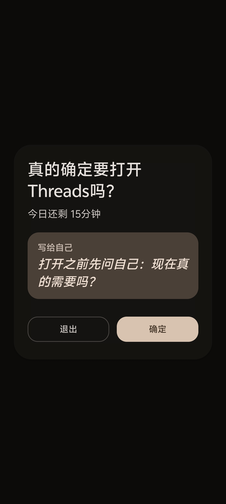
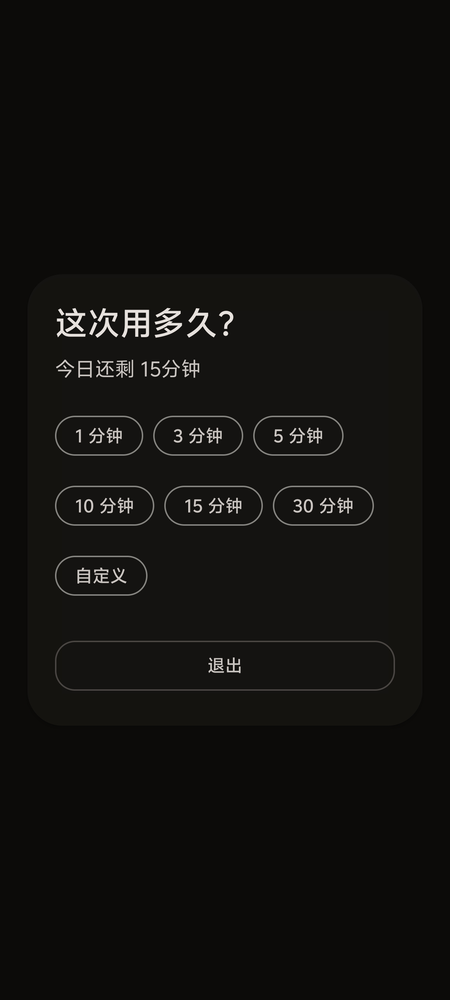
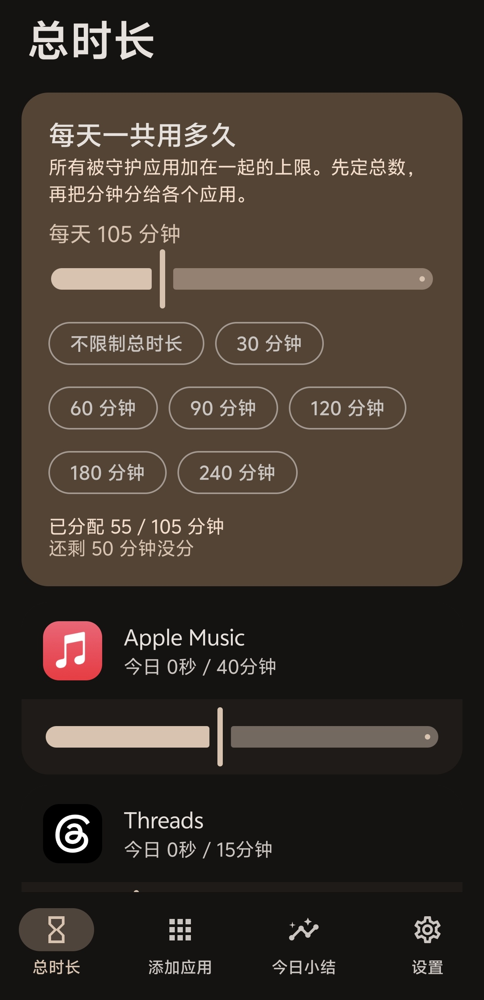
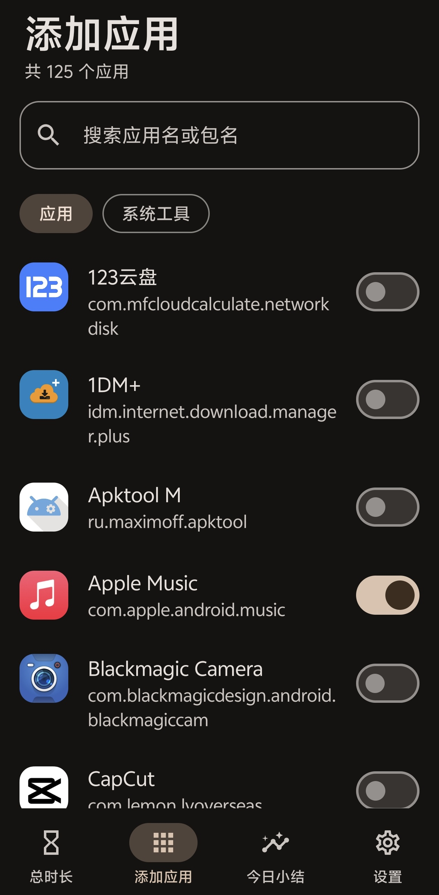
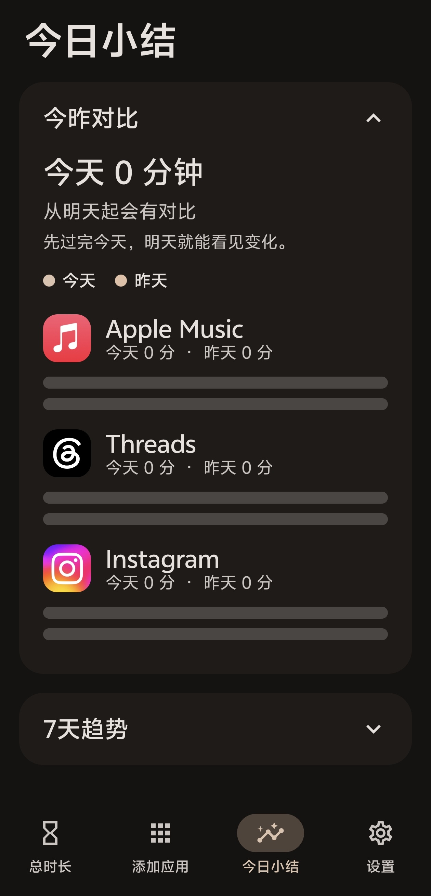
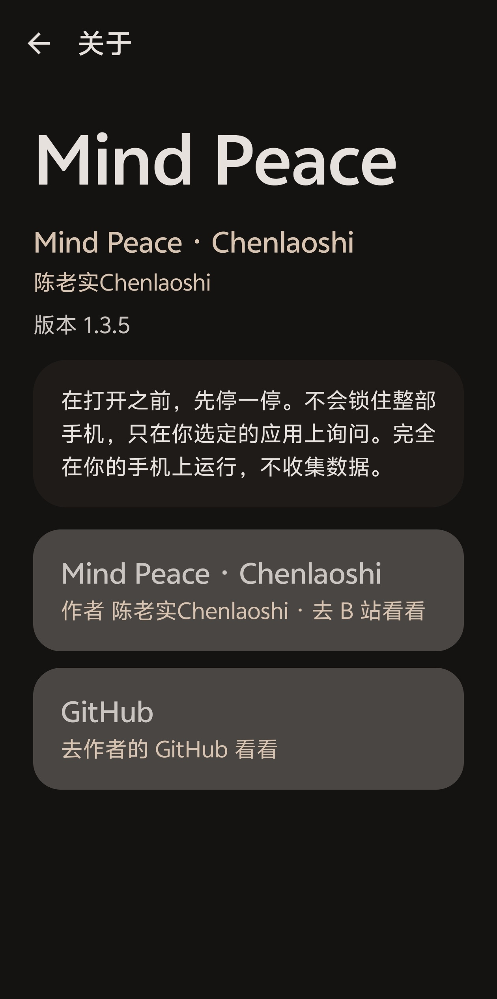

# Mind Peace

**先停一停，再打开。**  
**Pause first. Then open.**

Mind Peace 是一款温和的 Android 使用提醒应用。它**不会锁住整部手机**，只在你打开自己选定的应用时，先盖住一层确认：你是不是真的要打开？确认之后自己选多久；时间到了，回到桌面。

Mind Peace is a gentle Android pause-before-you-open app. It does **not** lock the whole phone. When you launch an app you chose to watch, it covers it with a confirmation: do you really want to open it? After you confirm, you pick how long. When time is up, you go home.

[下载 Debug 安装包 1.3.10](https://github.com/Chenlaoshiii/mind-peace/releases/download/v1.3.10/MindPeace-1.3.10-debug.apk) · [Releases](https://github.com/Chenlaoshiii/mind-peace/releases/tag/v1.3.10)

作者 [陈老实Chenlaoshi](https://space.bilibili.com/3546678682454822) · [GitHub](https://github.com/Chenlaoshiii/mind-peace) · `com.mindpeace.app` · minSdk 26 / targetSdk 35

---

## 中文

### 宗旨

刷短视频、看信息流，往往不是「决定要用十分钟」，而是手指已经滑进去了。Mind Peace 把「打开」这件事从惯性里抽出来，变成一次有意识的选择。

它站在你这边，不羞辱、不说教。拦截时会先看见你写给自己的那句话。少用了会鼓励你；晚上会轻轻告诉你今天和昨天差了多少。

<p>


</p>

### 它做什么，不做什么

**会做**

- 打开已守护应用时立刻盖住确认层（应用还在下面，但不能操作）
- 自己选本次时长：1 / 3 / 5 分钟，或自定义。倒计时只在该应用在前台时走
- 中途离开（回桌面、切到别的应用、打开 Mind Peace）会结束本次：已经用掉的计入今日用量，没用完的时间作废；下次打开会再次询问。离开本身不会再弹出拦截
- 某个应用今日额度用完后再调高限额，需先确认，并手打一句确认语
- 时间到回到桌面，并提醒「时间到了」
- 首页「总时长」可设所有被守护应用加在一起的每日上限，再把分钟分给各个应用（不能超过总数；0 表示这个应用不额外限额，仍受总时长剩余约束）。滑条按分钟无级调节，没有刻度点
- 一段时间没打开被守护应用，会发鼓励通知
- 大约晚上 9 点推送今日小结；「今日小结」页 **今昨对比** 默认展开，**7天趋势** 默认收起

**不会做**

- 不会锁整机、不会当家长控制工具去禁止别人
- 无障碍服务不读聊天、密码或屏幕文字，只关心是哪一个应用到了前台
- 不会拦截 Mind Peace 自己
- 不会上传任何使用记录，也没有任何数据收集。应用完全在你的手机上运行

### 总时长

先定今天所有被守护应用加在一起能用多久，再把分钟分给各个应用。总卡片上是滑条加快捷芯片；每个应用一张完整圆角卡片，图标、名称和滑条都在同一张卡里。都按整分钟无级滑动。

<p>

</p>

### 添加应用

底栏「添加应用」里搜索并勾选你想先停一停再打开的应用。只守护你选中的那些。

<p>

</p>

### 今日小结

今昨对比默认展开，7 天趋势默认收起。晚上大约 9 点还会推一条小结。

<p>

</p>

### 怎么用

1. 用下面 Build 说明自行编译 Debug 安装包（需允许未知来源）。覆盖安装即可。
2. 第一次打开会走引导（7 步）：欢迎 → 写给自己的话（三个预设或「自定义」）→ 一次使用是怎样的 → 开启**无障碍** → 关闭电池优化、允许通知、授权读取已安装应用 → 按机型锁定后台 → **郑重说明**（权限只为更准地拦截；绝不收集隐私；好心提醒：花钱买到此软件说明你被骗了，Mind Peace 完全免费）。无障碍真正打开、并勾选锁定确认后，「我完成」才会亮。
3. 底栏四个入口：**总时长**、**添加应用**、**今日小结**、**设置**。左右滑动即可切换，点底栏也会跟着滑过去。

**总时长（第一页）**

这里设的是：今天所有被守护应用加在一起，一共能用多久。先定当天的总分钟数（顶部那张卡，滑条按分钟无级）。

下面每一个应用一张圆角卡片。你可以给这个应用**单独分一段时间**（滑条约定它今天最多用多少分钟，不能超过还没分出去的总时长）。也可以把滑条拉到 0：**不单独限额**，这个应用和大家**共用还没分完的剩余时间**。分出去的分钟合计不能超过总时长。

**添加应用**

勾选要先确认再打开的应用。只拦你选中的。

**今日小结**

- **今昨对比**默认展开：看今天和昨天每个应用用了多久。
- **7 天趋势**默认收起。用满大约 7 天之后，这里会画出这一周的曲线，和前面几天的用量叠在一起看，而不是只有今昨两天。从第一天起就会记；趋势会随着天数变完整。
- 晚上大约 9 点还会推一条小结通知。

4. 之后打开这些应用，会先问「真的确定要打开××吗？」并显示你的那句话。选「确定」再选 1 / 3 / 5 分钟或自定义；「退出」回桌面。
5. 通知栏会显示剩余时间。到点回桌面。中途离开则本次结束：已经用掉的计入今日用量，没用完的时间作废；下次打开会再次询问。
6. 设置里：无障碍、电池、通知、悬浮窗（备用）、**个性主题**（浅色 / 深色 / 跟随系统）、**语言/Language**（跟随系统、简体中文、繁體中文、English、日本語、Русский、文言文、Español、Français；未选过则跟随手机语言）、改那句写给自己的话、重新看引导、关于。设置与关于可去 B 站、GitHub、酷安。关于页大标题连点 5 下可预览全部通知文案。

若拦截突然没了，打开应用看是否提示无障碍已关闭。小米 / 华为 / OPPO / vivo 请在最近任务里锁定 Mind Peace，并允许自启动与后台运行。

### 小巧思

- 不是整机锁，只拦你选的应用
- 打开前先看见写给自己的那句话；选 1 / 3 / 5 分钟或自定义；离开则剩余作废，且不会误拦一次
- 总时长 + 各应用滑条按分钟无级，没有 5 分钟一格、也没有手动输入框
- 额度已经用完再往上调，要两步确认并手打一句
- 今昨对比默认打开，7 天趋势默认收起
- 语言含跟随系统、文言文、西班牙语、法语
- 引导 7 步，郑重说明里写明完全免费；全程离线，不收集数据
- 主题：Material You（Android 12+ 跟随壁纸）；浅色 / 深色 / 跟随系统

### 主题

1.3.10：设置与关于可去 B 站、GitHub、酷安。1.3.9 起再次提供 GitHub 入口，指向 [Chenlaoshiii/mind-peace](https://github.com/Chenlaoshiii/mind-peace)（同时保留 B 站）。1.3.8 起去掉白色风格，个性主题只保留浅色 / 深色 / 跟随系统（Android 12+ 仍用 Material You 动态取色）。总时长里每个应用是一张完整圆角卡片（图标、名称、用量和滑条都在同一张卡里）。界面语言可在设置「语言/Language」切换（含文言文、西班牙语、法语；默认跟随手机系统语言，不支持的语言回落到简体中文）。四个主页可以左右滑动切换。

### 关于

作者 [陈老实Chenlaoshi](https://space.bilibili.com/3546678682454822)。源码在 [GitHub](https://github.com/Chenlaoshiii/mind-peace)。

<p>

</p>

### 隐私

Mind Peace 完全在你的手机上运行，不会上传任何使用记录。我们不收集数据。无障碍说明写在系统设置里：不读取聊天、密码或屏幕文字细节。用量存在本机 DataStore。源码公开，便于你自己编译。

---

## English

### Why it exists

Feeds and short video are easy to open on autopilot. Mind Peace pulls “open” out of habit and turns it into a choice. It is on your side: no shaming. The intercept screen shows a sentence you wrote to yourself. Quiet streaks get a celebration. Evening brings a calm recap versus yesterday.

<p>


</p>

### What it does and does not do

**Does**

- Overlay a confirmation the moment a watched app comes to the foreground
- Let you pick a session length: 1 / 3 / 5 minutes, or custom. The timer runs only while that app is in front
- Leaving (home, another app, or Mind Peace) **ends** the session: time already used is counted, leftover minutes are discarded, and the next open always asks again. Leaving itself does not show the intercept
- If an app’s daily allowance is already used up, raising that limit needs a confirmation and typing a sentence
- Send you home when time is up, with a reminder
- A global daily cap for all watched apps, then per-app allocations from that pool (allocations cannot exceed the total; 0 means no extra per-app cap beyond remaining global time). Sliders are stepless whole minutes, with no tick marks
- Celebration notifications after 4 hours / 1 day / 3 days without opening watched apps (quiet hours 22:00–08:00)
- A nightly summary around 21:00; Recap: **Today vs yesterday** is expanded by default, **7-day trend** is collapsed

**Does not**

- Lock the whole phone or act as parental control for someone else
- Read chat, passwords, or on-screen text; accessibility only sees which package is in front
- Intercept Mind Peace itself
- Collect or upload usage. Everything stays on the device.

### Daily cap

Set one daily total for every watched app, then share those minutes out. The global card has a slider plus chips; each app is one full rounded card with icon, name, and slider. Both move in whole minutes with no snapping.

<p>

</p>

### Add apps

Search and check the apps you want to pause on. Only the ones you pick are watched.

<p>

</p>

### Today’s recap

Today vs yesterday starts expanded; the 7-day trend starts collapsed. A recap notification goes out around 21:00.

<p>

</p>

### How to use

1. Build the debug APK with the instructions below (unknown sources). You can install over a previous debug build.
2. First launch is gated onboarding (7 steps): welcome, a line to yourself (three presets or Custom), how a session works, **Accessibility**, battery optimization + notifications + permission to list installed apps, lock in Recents, then a solemn privacy step (permissions exist only to intercept accurately; nothing is collected; a kind reminder: if you paid for this app, you were scammed — it is free). “I’m done” enables only when accessibility is actually on and the recents checkbox is checked.
3. Bottom bar: **Daily cap**, **Add apps**, **Today’s recap**, **Settings**. Swipe left/right between tabs, or tap the bar.

**Daily cap (first tab)**

This is how long every watched app together may run today. Set the day’s total minutes first (the top card; the slider is stepless, whole minutes).

Each app below sits on its own rounded card. You can **give that app its own slice** (the slider is its max minutes today, and it cannot exceed minutes that are still unallocated). You can also drag the slider to 0: **no per-app cap** — that app **shares the remaining unallocated time** with everyone else. Allocated minutes cannot add up to more than the daily total.

**Add apps**

Check the apps that should ask before they open. Only the ones you pick are watched.

**Today’s recap**

- **Today vs yesterday** starts expanded: see how long each app ran today versus yesterday.
- **7-day trend** starts collapsed. After about a week of use, this draws the week’s curve so you can stack the last few days together, not just today and yesterday. Recording starts on day one; the trend fills in as days accumulate.
- A recap notification also goes out around 21:00.

4. Opening a watched app asks if you really want to open it, with your quote. Confirm, then pick 1 / 3 / 5 minutes or custom; Exit returns to the launcher.
5. A notification shows remaining time. When time is up you go home. Leave the app and the session ends: time already used is counted, leftover minutes are discarded, and the next open always asks again.
6. Settings: accessibility, battery, notifications, overlay (fallback), **Appearance** (light / dark / system), **Language/Language** (Follow system, Simplified Chinese, Traditional Chinese, English, Japanese, Russian, Literary Chinese, Spanish, French; follows the phone language until you pick one), edit your quote, replay setup, About. Settings and About can go to Bilibili, GitHub, Coolapk. Tap the big About title five times to preview every notification template.

If intercepts stop, open the app and check accessibility. On Xiaomi / Huawei / OPPO / vivo, lock Mind Peace in Recents and allow autostart / background.

### Small details

- Not a whole-phone lock; only the apps you select
- A quote to yourself on intercept; duration 1 / 3 / 5 or custom; leftover time is voided when you leave; leaving does not false-intercept
- Global daily cap plus per-app stepless whole-minute sliders (no 5-minute snap, no minute text field)
- Raising a spent quota is a two-step confirm-and-type challenge
- Recap: today vs yesterday open by default, 7-day trend collapsed
- Languages include Follow system, Literary Chinese, Spanish, and French
- Onboarding is 7 steps, with a free-app warning; fully offline, no collection
- Themes: Material You (dynamic color on Android 12+); light / dark / system

### Appearance

1.3.10: Settings and About can go to Bilibili, GitHub, Coolapk. 1.3.9 restored a GitHub card pointing at [Chenlaoshiii/mind-peace](https://github.com/Chenlaoshiii/mind-peace) (Bilibili stays). Since 1.3.8 the White visual style is gone. Appearance is light / dark / follow system (Material You dynamic color on Android 12+). Each watched app on Daily cap sits on one full rounded card (icon, name, usage, and slider together). UI language is in Settings as Language/Language (including Literary Chinese, Spanish, French); by default it follows the phone language, with Simplified Chinese as the fallback. The four main tabs swipe sideways.

### About

Author [陈老实Chenlaoshi](https://space.bilibili.com/3546678682454822). Source: [GitHub](https://github.com/Chenlaoshiii/mind-peace).

<p>

</p>

### Privacy

Fully offline. No collection, no upload. Usage stays on-device in DataStore. Accessibility does not scrape message contents. This repository is public so you can build it yourself.

---

## Build

Android Studio (JDK 17), File → Open this repo, sync, install SDK 35 if asked. Prefer a real device; accessibility is incomplete on many emulators.

```bash
./gradlew assembleDebug
```

Output: `app/build/outputs/apk/debug/app-debug.apk`.

Kotlin + Jetpack Compose + Material 3. AccessibilityService overlay, foreground session timer, WorkManager for celebrations and the evening summary.

## License

Personal project by [陈老实Chenlaoshi](https://space.bilibili.com/3546678682454822). Source: [github.com/Chenlaoshiii/mind-peace](https://github.com/Chenlaoshiii/mind-peace).
